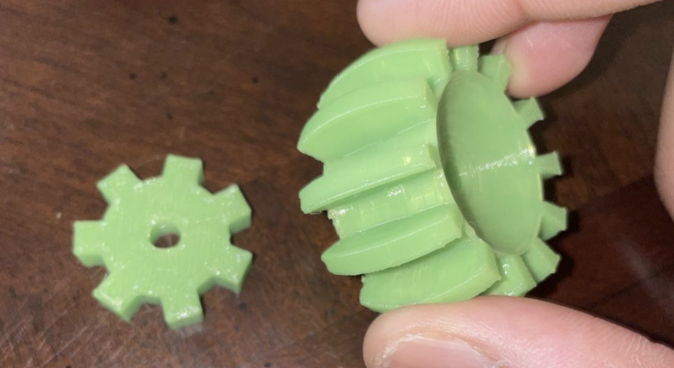
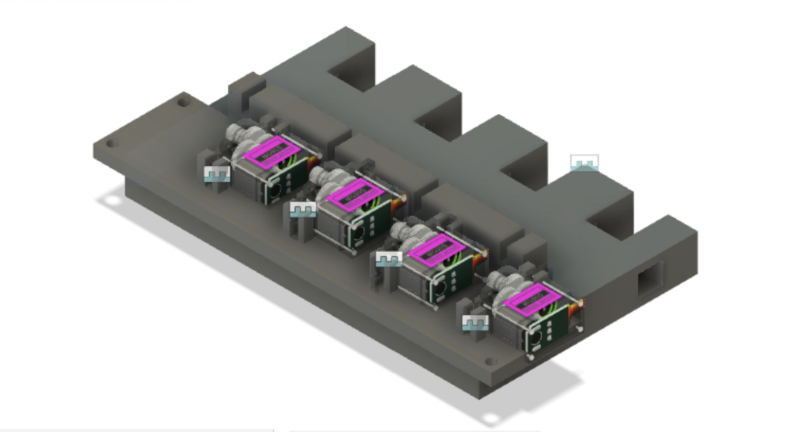
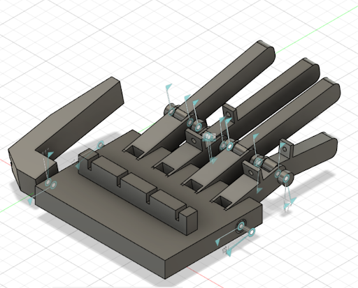

## Goal

<u>

### Mission

</u>

The primary objective of Piano Hand is to explore the perspective of robotics in replicating human-motion. Fascination for this included looking at tasks that would help us understand biomechanics, which is an area of robotics that has gained a lot of traction recently. 

The goal of the project is to build a fully autonomous robot arm that can play the piano. The human hand, with 27 degrees of freedom (DOF), has so far been the most dextrous mechanism to play the piano and the closer we get to replicating that degree of freedom and movement, the better it is to move the arm and play the piano.



This semester (Fall 2022), we are planning to refine our working model of the animatronic hand built last semester with the help of accurate servo motor and flex sensor functioning. We would expect to extend functioning to two hands as well. Additionally, we are starting a new path in software along the lines of machine learning and optical image recognition by building a model that can read sheet music, given an image format.

Along the way, we will publish our progress, code, tutorials and workshops.

Project GitHub Repositories: <a href="https://github.com/purdue-arc/arc-piano-hand-code"> https://github.com/purdue-arc/arc-piano-hand-code </a>, <a href="https://github.com/purdue-arc/arc-piano-hand">https://github.com/purdue-arc/arc-piano-hand </a>

(The above two will be combined soon.)

---

## What we have done

<u>

### Summer 2022

</u>

Ideated and designed new mechanisms for the hand that involves the usage of linear actuators and bevel gears. This design will be assembled and tested in Fall 2022 as a new iteration from the hand design in Spring 2022.

Worked on fixing issues that came about in software in Spring 2022, and in getting ready the design to implement on the hand in Fall 2023. Introduced new course of action alongside software to start with machine learning and model development in Optical Music Recognition.

Clip from working of servos:



<u>

### Spring 2022

</u>

Worked on improving model developed in Fall 2021 by printing and testing. An add-on for attaching the servo motors was developed and the design was 3D-printed.

Software work primarily included setup of environment on Arudino/Raspberry Pi, along with flex sensors. Issues with the usage of continuous servos were addressed. 8-bit ADCs were also used to improve testing.



<u>

### Fall 2021

</u>

Worked primarily on developing models and getting an idea of the different parts necessary to 3-D print. Produced the following first iteration of the hand by the end of the semester from hardware.

Software primarily worked on simulation and testing, and the following simulation was produced on TinkerCAD (TinkerCAD's electronic component simulator had Arduino testing capabilities and hence was useful for the first stage of testing). TInkerCAD's use-cases for simulation testing were visible from early testing with the software for multiple fingers, using MG90S servos.



---

### Subteams and Roster

<u>

#### Project Manager

</u>

Revanth Krishna Senthilkumaran, Computer Engineering

<u>

#### Hardware

</u>

Hardware primarily works on making and refining CAD models with tools available, 3D printing models, assembling, testing and identifying points of improvement in the model and testing functionality. 

<ul>
<li>
<b>Lead</b>: Rugved Dikay, Aeronautical and Aerospace Engineering
</li>
<li>
Akshay, Electrical Engineering
</li>
<li>
Archis Behere, Mechanical Engineering
</li>
</ul>

<u>

#### Software

</u>

Software primarily works on developing the code and algorithms for the movement of the hand to locations computed, along with setup of the electrical systems. More recent initiatives include model development for optical music recognition and Raspberry Pi conversion from Arduino.

<ul>
<li>
Dhruv Sujatha, Data Science
</li>
<li>
Jacob Aldridge, Computer Science
</li>
<li>
Manas Paranjape, Computer Science
</li>
<li>
Visuwanaath Selvam, Computer Engineering
</li>
</ul>

---

<!-- ### Images/GIFs -->

<!-- ## Summary -->

## See Also:

<h3> Inspiration / Other Projects </h3>

<ol>

<li>
 A team of researchers attempted replicating the pressure applied in the grasping mechanism and achieved 17 DOF in a 5-finger hand. The actuators used are the most interesting: McKibben Actuators, which move on the basis of difference in Air Pressure. <a href="https://www.sciencedirect.com/science/article/pii/B9780081005743000102"> ScienceDirect article </a> 
</li>

<li>
The ILDA Robot Hand: A 15 DOF, highly tactile robot hand, motion along surface of palm, and stepper motor actuation. Some of its capabilities include crushing cans, delicate grasping, and tactile tasks such as tapping. <a href="https://gizmodo.com/lifelike-robotic-hand-is-a-bit-too-close-to-terminator-1848213189"> Overview and Videos of Functioning </a> |  <a href="https://www.nature.com/articles/s41467-021-27261-0"> Nature article </a>
</li>

<li>
Soft actuated robots - <a href="https://dash.harvard.edu/bitstream/handle/1/25922120/66841469.pdf;sequence=1"> Harvard paper </a> | 
</li>

<li>
WPI - <a href="https://web.wpi.edu/Pubs/E-project/Available/E-project-042919-161531/unrestricted/Piano_Playing_Robotic_Arm_MQP_-_Final.pdf"> MQP
</li>

<li>
Allegro Hand - <a href="http://wiki.ros.org/Robots/AllegroHand">ROS Documentation</a> | <a href="https://www.youtube.com/watch?v=WzJJ4c6AqnE"> MIT Grad Student's Piano Hand</a>
</li>

<li>
Robot Nano Hand - <a href="https://youtu.be/uOeS_jklU2Y">YouTube</a> | <a href="https://robotnanohand.com/"> Site </a> 
</li>

<li>
InMoov Robot Hand - <a href="https://www.thingiverse.com/thing:17773">Parts and Paper Link</a>
</li>

<li>
Other similar project resources: <a href="https://create.arduino.cc/projecthub/laurencemlai/diy-glove-controlled-robotic-hand-ff5d63"> Arduino Project Hub </a> | <a href="https://www.instructables.com/DIY-Robotic-Hand-Controlled-by-a-Glove-and-Arduino/"> Instructables </a>
</li>

<li>
Video Links/Pages referred: <a href="https://www.youtube.com/c/WillCogley">Will Cogley</a> | Automation Robotics' <a href="https://www.youtube.com/channel/UCd0xLOw6No5IAsq3Y2-b0eA">Clone</a>
</li>

</ol>

<h3> References </h3>

<ol>

<li>
Piano Keys Research - <a href="https://music.stackexchange.com/questions/53847/what-are-the-dimensions-of-piano-keys-in-inches"> Dimensions </a>
</li>

<li>
Joint Design - <a href="https://www.youtube.com/watch?v=AJ9zVYQw5XU">Ball and Socket</a> 
</li>

<li>
Optical Music Recognition Datasets - <a href="https://apacha.github.io/OMR-Datasets/"> Apacha Database List </a> | <a href="https://tuggeluk.github.io/deepscores/"> Deepscores </a> | <a href="https://grfia.dlsi.ua.es/primus/"> Primus </a>
</li>

<li>
Raspberry Pi-Arduino Connectivity - <a href="https://www.aranacorp.com/en/communication-between-raspberry-pi-and-arduino-with-i2c/"> AranaCorp </a> | <a href="https://maker.pro/raspberry-pi/tutorial/raspberry-pi-4-gpio-pinout"> Pi4 GPIO </a> 
</li>

<li>
Parts - <a href="https://cdn-learn.adafruit.com/downloads/pdf/adafruit-4-channel-adc-breakouts.pdf">ADCs</a> | Multi-channel Servo Controller (<a href="https://www.adafruit.com/product/2327?gclid=COGwqIfL99ECFYQDaQodjtQPXQ">16</a>, <a href="https://shop.pimoroni.com/products/servo-2040?variant=39800591679571">18</a>) | <a href="https://www.youtube.com/watch?v=2vAoOYF3m8U"> Linear Servo Actuators </a> - <a href="https://www.myminifactory.com/object/3d-print-77542">CAD Files 1</a>, <a href="https://www.thingiverse.com/thing:3170748/files">CAD Files 2</a>
</li>

<li>
Add-ons: Strings/Thread <a href="https://www.amazon.com/Cotton-String-Cooking-Kitchen-Wrapping/dp/B07KVSVTVV/ref=sr_1_1_sspa?crid=3ANYCTZMK7A2X&keywords=cotton+string+3mm&qid=1649018569&sprefix=cotton+string+3mm%2Caps%2C72&sr=8-1-spons&psc=1&spLa=ZW5jcnlwdGVkUXVhbGlmaWVyPUFDQTNFRjhSR1IzNEkmZW5jcnlwdGVkSWQ9QTA5MDkwNzczUVJLU1FGRTJYME1RJmVuY3J5cHRlZEFkSWQ9QTAzMzE0NzIyV0w0MTJLOU8yNUVTJndpZGdldE5hbWU9c3BfYXRmJmFjdGlvbj1jbGlja1JlZGlyZWN0JmRvTm90TG9nQ2xpY2s9dHJ1ZQ=="> 1 </a>, <a href="https://www.amazon.com/gp/product/B01FICZLU8/ref=ewc_pr_img_2?smid=A27A1UMDQYE0QB&th=1"> 2 </a> | <a href="https://www.amazon.com/Winter-Gloves-Men-Women-Waterproof/dp/B09FPS6HHH/ref=sr_1_7?crid=GDR5H6K8SH8I&keywords=amazon%2Bcloth%2Bgloves&qid=1644791622&sprefix=amazon%2Bcloth%2Bglove%2Caps%2C83&sr=8-7&th=1&psc=1"> Gloves </a>
</li>

<li>
DOF Analysis - <a href="https://www.researchgate.net/publication/264907843_Real-time_hand_tracking_for_rehabilitation_and_character_animation"> +Real-time Hand Tracking </a> | <a href="https://support.ptc.com/help/creo/creo_pma/r6.0/usascii/index.html#page/simulate/mech_des/connections/calculating_dof_redund.html">Calculator</a> | <a href="https://www.mecharithm.com/degrees-of-freedom-of-a-robot/"> Mecharithm </a> | <a href="https://www.techopedia.com/definition/12702/six-degrees-of-freedom-6dof"> Technopedia </a>
</li>

<li>
Interesting Actuation Methods - <a href="https://www.frontiersin.org/articles/10.3389/frobt.2020.586216/full">Voltage-Controlled Linear Actuation</a>
</li>

</ol>

<!-- ## References -->